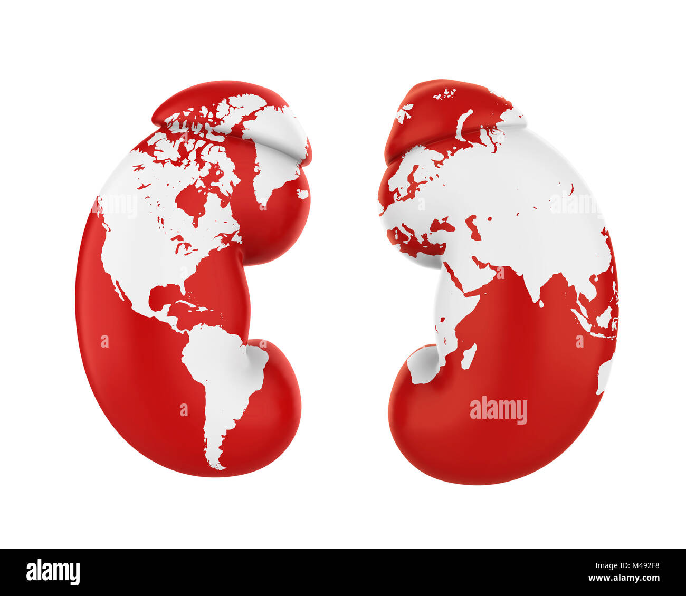

<h1 align="center">ADOKA: Automated Diagnosis of Kidney Abnormalities</h1>

  

Overview

ADOKA is a machine learning-powered web application designed to classify kidney CT scan images into four distinct categories:

<ul>
  <li><strong>Normal</strong></li>
  <li><strong>Cyst</strong></li>
  <li><strong>Stone</strong></li>
  <li><strong>Tumor</strong></li>
</ul>

This tool aims to assist healthcare professionals by providing quick and accurate diagnoses of kidney abnormalities using state-of-the-art deep learning models. The project integrates several modern tools and frameworks such as MLflow, DagsHub, DVC, and custom-crafted components to ensure a streamlined machine learning lifecycle and reproducible results.

Features
<ul>
  <li><strong>Multiple Image Upload</strong>: Upload one or more kidney CT scan images for analysis.</li>
  <li><strong>Real-time Predictions</strong>: Get instant predictions for uploaded images.</li>
  <li><strong>User-Friendly Interface</strong>: A streamlined and intuitive interface built using Streamlit.</li>
  <li><strong>Model Tracking</strong>: MLflow is used for tracking experiments, metrics, and models.</li>
  <li><strong>Data Versioning</strong>: DVC ensures version control of datasets and machine learning models.</li>
  <li><strong>Reproducible Pipelines</strong>: DagsHub integrates with DVC and MLflow to enable easy collaboration and pipeline reproducibility.</li>
  <li><strong>Deployment</strong>: Easily deployable as a Docker container for consistent and reproducible environments.</li>
</ul>
Project Structure
<pre>
<code>
├── app.py                 # Main Streamlit app
├── assets                 # Contains static assets like the logo
├── Dockerfile             # Docker configuration
├── dvc.yaml               # DVC pipeline definition
├── main.py                # Entry point for the application
├── README.md              # Project documentation
├── research               # Research and development files
├── setup.py               # Setup script for package installation
├── template.py            # Template file for app structure
├── workflow.txt           # Workflow description
├── artifacts              # Directory for storing model artifacts
├── config                 # Configuration files
├── dvc.lock               # DVC lock file
├── logs                   # Directory for logging information
├── params.yaml            # Parameters for model training
├── requirements.txt       # Python dependencies
├── scores.json            # Model scores and evaluation metrics
├── src                    # Source code for the application
│   └── kidney_disease_classifier
│       ├── components     # Core components of the application
│       ├── config         # Configuration handling
│       ├── constants      # Constant definitions used across the project
│       ├── entity         # Entity classes for structured data representation
│       ├── __init__.py    # Package initialization
│       ├── pipeline       # Pipeline for prediction and model handling
│       ├── __pycache__    # Compiled Python files
│       └── utils          # Utility functions
├── templates              # HTML templates for the app
</code>
</pre>
Getting Started
Prerequisites

Ensure you have Docker installed on your system. You can download Docker from <a href="https://www.docker.com/products/docker-desktop">here</a>. Additionally, make sure you have <a href="https://dvc.org/">DVC</a> and <a href="https://mlflow.org/">MLflow</a> installed for data versioning and experiment tracking.

Installation
<ol>
  <li><strong>Clone the repository:</strong>
    <pre><code>git clone https://github.com/Chukwukwadorom/ADOKA.git
cd ADOKA</code></pre>
  </li>
  <li><strong>Set up DVC:</strong>
    <pre><code>dvc pull</code></pre>
    
This command pulls the latest version of the dataset and models from DagsHub, ensuring you have the necessary data to run the application.

  </li>
  <li><strong>Build the Docker image:</strong>
    <pre><code>docker build -t adoka-app .</code></pre>
  </li>
  <li><strong>Run the Docker container:</strong>
    <pre><code>docker run -p 8501:8501 adoka-app</code></pre>
  </li>
  <li><strong>Access the app:</strong>
    
Open your web browser and navigate to <a href="http://localhost:8501">http://localhost:8501</a> to interact with the ADOKA application.

  </li>
</ol>
Usage
<ol>
  <li><strong>Upload Images:</strong>
    
Click on "Browse files" to select and upload one or more kidney CT scan images in <code>.png</code>, <code>.jpg</code>, or <code>.jpeg</code> format.

  </li>
  <li><strong>View Predictions:</strong>
    
After uploading, the app will display the images along with their predicted labels: Normal, Cyst, Stone, or Tumor.

  </li>
</ol>
Model

The model used in ADOKA is a Convolutional Neural Network (CNN) based on the VGG16 architecture, fine-tuned for the task of kidney abnormality classification. The model is trained on a dataset of labeled CT scan images. MLflow is used to track different versions of the model, while DVC ensures that the dataset and model versions are in sync.

Experiment Tracking with MLflow

MLflow is integrated into ADOKA to manage and track experiments, ensuring that model training, parameters, and results are systematically recorded and accessible. You can access the MLflow UI by navigating to the <code>mlflow_experiments</code> directory and running:

<pre><code>mlflow ui</code></pre>
Data Versioning with DVC

DVC (Data Version Control) manages the versioning of datasets and machine learning models, allowing for reproducible experiments. The <code>dvc.yaml</code> file defines the data pipelines, ensuring that all stages from data ingestion to model training are reproducible.

Pipeline Management with DagsHub

DagsHub integrates with both DVC and MLflow, providing a collaborative platform for version control, experiment tracking, and pipeline management. The project is configured to use DagsHub as a remote storage and pipeline orchestrator.

I used this workflow:
Update config.yaml
Update secrets.yaml [Optional]
Update params.yaml
Update the entity
Update the configuration manager in src config
Update the components
Update the pipeline
Update the main.py
Update the dvc.yaml
